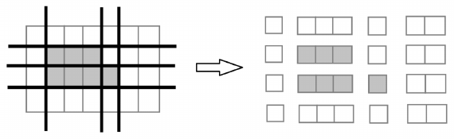

Luka loves chocolate. He is very excited to eat a large chocolate bar made of $n$ rows and $m$ columns he got for his birthday. The chocolate consists of black and white squares of chocolate. However, Luka doesn’t really like white chocolate and would only like to eat the black squares.

Before he starts eating, Luka will cut the chocolate. He will make a number of vertical and/or horizontal cuts in between the rows and the columns of the chocolate. A vertical cut goes from the top edge of the chocolate to the bottom edge, while a horizontal cut goes from the left edge to the right edge. After making the cuts, Luka will obtain several rectangular pieces of chocolate.

Since Luka will only eat the black parts of the chocolate, he wants to completely seperate the black squares from the white squares. This means that every resulting piece must consist entirely of black chocolate or entirely of white chocolate.

Luka would rather start eating as soon as possible instead of wasting time cutting so he asks you to help him determine the minimum number of cuts required to separate the black squares from the white squares.



Slika 1: This is how the chocolate from the first example should be cut in order to separate the black parts from the white parts with minimum number of cuts

## Input

In the first line, there are two natural numbers $n$ and $m$ ($1 \le n,m \le 200$), representing the number of rows and columns of the chocolate.

Each of the following $n$ lines contains $m$ characters, each of which is either 0 or 1. The character 0 denotes a white square, and 1 denotes a black square.

## Output

In the first and only line, output a single number - the minimum number of cuts required to separate the black squares from the white squares.

## Examples

### Example 1

Input

```text
4 7
0000000
0111000
0111100
0000000
```

Output

```text
6
```

### Example 2

Input

```text
4 5
00000
01100
01100
00000
```

Output

```text
4
```

### Example 3

Input

```text
4 4
0101
1010
0101
1010
```

Output

```text
6
```

### Clarification of the first example:

Explained in the drawing.

### Clarification of the second example:

Luka should make a cut between the first and second row, third and fourth row, first and second column, and third and fourth column.

### Clarification of the third example:

Luka should make a cut between every two adjacent rows and columns - a total of 6 cuts.
