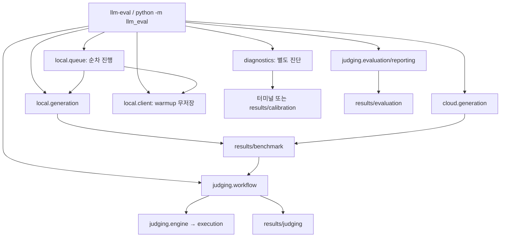

# 코드·파일 책임 지도

이 문서는 저장소의 현재 구조와 파일별 책임를 한 곳에서 찾기 위한 지도다. 실제 모델·Cloud 호출, 후보 채점, GPU 확인, 결과 내용은 이 문서의 근거가 아니다. 결과와 로그는 파일 이름·폴더 역할만 문서화하며 내용을 복사하지 않는다.

## 실행 경계

모든 명령은 저장소 루트에서 실행한다. 표준 인터페이스는 설치된 console script `llm-eval` 하나다.

```text
uv run llm-eval generate local    --model <qwen36|gemma4> --problems <ids|all> --round <1|2>
uv run llm-eval generate cloud    --model <luna|motif3> --problems <ids|all> [--round <1|2>]
uv run llm-eval queue              [--startup-timeout-seconds <seconds>]
uv run llm-eval warmup             --model <qwen36|gemma4>
uv run llm-eval judge batch        [--problems ...] [--models ...] [--rounds ...]
uv run llm-eval judge candidate    --code <path> --problem <id>
uv run llm-eval evaluate prepare    --baseline <session-id>
uv run llm-eval evaluate run        --evaluation <evaluation-id> --kind <limits|repairs>
uv run llm-eval evaluate report     --evaluation <evaluation-id>
uv run llm-eval validate
uv run llm-eval diagnose response
uv run llm-eval diagnose generation-limit --model <qwen36|gemma4>
```

로컬과 Cloud 모두 `--model`은 필수다. 로컬 `--round`는 필수이며 Cloud `--round`의 기본값은 1이다. Cloud `--model`의 값은 결과 경로의 모델 폴더 이름이자 `judge batch --models`의 선택 이름과 같다. 두 회차는 이전 답변을 입력으로 사용하지 않는 독립 요청이다. `results/benchmark/<problem>/<model>/round_<n>/`의 경로와 생성 기록의 회차·모델·문제 식별자는 유지한다. `judge batch`는 공식 1배 시간 제한 기준 세션을 만들고, `evaluate prepare`가 그 세션에 연결된 평가 ID와 정책을 만든다. `evaluate run`만 판정·후보 실행을 수행해 judge workload로 분류하며, `prepare`와 `report`는 파일을 읽고 쓰는 준비·집계 명령이다.

아래 표는 제거된 명령의 역사적 매핑이다. 현재는 호환 wrapper나 `scripts/` 파일을 제공하지 않으며, 표의 이전 명령을 다시 실행하지 않는다. 이미 실행 중인 구형 프로세스를 workload 검사에서 식별할 수는 있지만 그것은 CLI 호환을 뜻하지 않는다.

| 제거된 이전 명령 | 현재 명령 | 과거 책임 |
| --- | --- | --- |
| `uv run python scripts/run_local_benchmark.py ...` | `uv run llm-eval generate local ...` | 로컬 생성 |
| `uv run python scripts/run_cloud_benchmark.py ...` | `uv run llm-eval generate cloud ...` | Cloud 생성 |
| `uv run python scripts/run_local_queue.py ...` | `uv run llm-eval queue ...` | 서버·워밍업·로컬 회차 예약 |
| `uv run python scripts/run_warmup.py ...` | `uv run llm-eval warmup ...` | 무저장 워밍업 |
| `uv run python scripts/run_batch_judge.py ...` | `uv run llm-eval judge batch ...` | 오프라인 일괄 채점 |
| `uv run python scripts/check_candidate.py ...` | `uv run llm-eval judge candidate ...` | 단일 후보 채점 |
| `uv run python scripts/validate_dataset.py` | `uv run llm-eval validate` | metadata·문제 데이터 검증 |
| `uv run python scripts/diagnostics/response_probe.py` | `uv run llm-eval diagnose response` | 응답 진단 |
| `uv run python scripts/diagnostics/generation_limit_probe.py ...` | `uv run llm-eval diagnose generation-limit ...` | 출력 한도 진단 |
| `uv run python scripts/diagnose.py` | `uv run llm-eval diagnose response` | 단일 응답 진단 |
| `uv run python scripts/calibration/run_stress_test.py ...` | `uv run llm-eval diagnose generation-limit ...` | 생성 한도 진단 |
| `uv run python scripts/run_benchmark.py ...` | 위 local 명령 | legacy local alias |
| `uv run python scripts/run_judge.py ...` | 위 batch 명령 | legacy judge alias |

`llm-eval`는 `shared/workloads.py`가 프로세스 목록에서 하위 명령을 읽을 수 있어야 한다. `generate local`, `warmup`, `queue`는 로컬 잠금, `generate cloud`는 Cloud 잠금, `judge`와 `evaluate run`은 두 잠금를 사용한다. `evaluate prepare`와 `evaluate report`는 모델·후보를 실행하지 않는다. 진단 중 로컬 서버를 부르는 명령도 로컬 작업으로 감지한다. `validate`는 모델 작업이 아니다. 작업 검사는 이미 실행 중인 이전 script 이름을 보존한 감지 항목이 있지만, 현재 실행 진입점은 root CLI 하나다.




## 현재 패키지 트리

```text
src/llm_eval/
├── __init__.py
├── __main__.py
├── cli.py
├── diagnostics.py
├── local/
│   ├── __init__.py
│   ├── client.py
│   ├── generation.py
│   ├── metrics.py
│   ├── queue.py
│   └── server.py
├── cloud/
│   ├── __init__.py
│   ├── client.py
│   ├── generation.py
│   └── metrics.py
├── judging/
│   ├── __init__.py
│   ├── workflow.py
│   ├── engine.py
│   ├── execution.py
│   ├── evaluation.py
│   └── reporting.py
└── shared/
    ├── __init__.py
    ├── problems.py
    ├── artifacts.py
    ├── storage.py
    ├── code_extraction.py
    └── workloads.py
```

`scripts/`는 제거 완료했다. 이전 provider CLI·record·warmup·path·prompt·process 책임은 아래 표의 package 모듈로 합쳤다.

## 소스 파일별 책임

| 파일 | 맡는 함수·책임 | 주요 호출자 | 관련 테스트 |
| --- | --- | --- | --- |
| `cli.py` | `parse_args`, `project_root`, `dispatch`, `main`: 인자 해석·저장소 위치 검사·기능 연결 | `__main__.py`, `pyproject.toml`의 console script | `tests/test_cli.py`, `tests/shared/test_commands.py` |
| `__main__.py` | `python -m llm_eval`을 `cli.main()`으로 연결 | Python 모듈 실행 | `tests/test_cli.py` |
| `diagnostics.py` | `run_response_probe`, `run_generation_limit_probe`: 별도 고정 입력 진단; CLI가 실행 시 import | `cli.dispatch` | `tests/shared/test_commands.py` |
| `local/client.py` | `create_client`, `generation_config`, `chat`: 로컬 요청과 공통 설정; `request_warmup`, `run_warmup`: 무저장 워밍업 | `cli.dispatch`, `local/generation.py`, `diagnostics.py` | `tests/local/test_generation.py`, `tests/local/test_warmup.py`, `tests/shared/test_conditions.py` |
| `local/generation.py` | `build_record`, `request_conditions`, `preflight_problem`, `run_problem`, `run_selected`: 재개 검사·생성·원자적 응답 저장 | `cli.dispatch`, `local/queue.py` | `tests/local/test_generation.py`, `tests/shared/test_conditions.py` |
| `local/metrics.py` | `measured_metrics`, `safe_memory`: 경과 시간·토큰 속도·GPU 메모리 관측과 누락 사유 | `local/generation.py` | `tests/local/test_metrics.py` |
| `local/queue.py` | `LocalQueue`, `run_queue`: 모델 전환·워밍업·회차 순서·자신이 시작한 프로세스 정리 | `cli.dispatch` | `tests/local/test_queue.py`, `tests/local/test_queue_inheritance.py` |
| `local/server.py` | `find_server_pid`, `wait_ready`, `stop_owned`: 서버 PID·포트·준비 상태·종료 관리 | `local/queue.py`, `local/metrics.py` | `tests/local/test_server.py`, `tests/local/test_metrics.py` |
| `cloud/client.py` | `PROVIDERS`, `get_provider`, `request_options`, `build_request`, `generation_config`, `create_client`, `send`, `normalize`: Cloud 제공자 등록부와 Responses·Chat Completions 계열별 요청·응답 어댑터 | `cloud/generation.py` | `tests/cloud/test_client.py`, `tests/cloud/test_generation.py`, `tests/cloud/test_motif.py` |
| `cloud/generation.py` | `completed_record`, `request_conditions`, `build_record`, `run_problem`, `run_selected`: 제공자별 독립 회차·재개·원본 저장 | `cli.dispatch` | `tests/cloud/test_generation.py`, `tests/cloud/test_motif.py`, `tests/cloud/test_selection.py`, `tests/shared/test_conditions.py` |
| `cloud/metrics.py` | `PRICING`, `USAGE_FIELDS`, `measured_metrics`, `estimated_cost`: 제공자별 usage 필드 대응과 확인한 단가표가 있는 모델만의 예상 비용 계산 | `cloud/generation.py` | `tests/cloud/test_cost.py`, `tests/cloud/test_generation.py`, `tests/cloud/test_motif.py` |
| `judging/workflow.py` | `MODEL_IDS`, `CLOUD_MODELS`, `collect`, `build_manifest`, `process_entry`, `finish_manifest`, `run_batch_judging`, `run_candidate_check`: 채점 대상 모델 등록부·수집·세션 기록·채점 조율 | `cli.dispatch` | `tests/judging/test_workflow.py` |
| `judging/engine.py` | `run_test_case`, `judge_problem`: 테스트별 판정과 AC/WA/TLE/OLE/RE/JUDGE_ERROR 집계 | `judging/workflow.py` | `tests/judging/test_engine.py`, `tests/judging/test_workflow.py` |
| `judging/execution.py` | `spawn_isolated`, `collect_bounded_output`, `terminate_process_group`: 프로세스 그룹·출력 수집·시간/출력 제한·정리 | `judging/engine.py` | `tests/judging/test_execution.py`, `tests/judging/test_engine.py` |
| `judging/evaluation.py` | 기준 채점 세션에 평가 정책을 봉인하고 scoring 제한 재평가·보조 수정 시도를 append-only로 실행; `baseline_1x`·`limit_2x`·`pending_limits` 출처를 관리 | `cli.dispatch`의 `evaluate` | `tests/judging/test_evaluation.py`, `tests/judging/evaluation_helpers.py` |
| `judging/reporting.py` | 평가 리뷰·원본 지표·판정의 누락을 보존한 채 모델별 원본 정답률·보조 통과·설명·응답 시간과 JSON/Markdown 보고서 집계 | `cli.dispatch`의 `evaluate report` | `tests/judging/test_reporting.py` |
| `shared/problems.py` | `load_problems`, `select_problems`, `problem_prompt`, `build_problem_prompt`, `validate_dataset`: 문제 입력·선택·프롬프트·데이터 검증 | `cli.dispatch`, `local/generation.py`, `cloud/generation.py`, `judging/workflow.py` | `tests/shared/test_conditions.py`, `tests/shared/test_commands.py` |
| `shared/artifacts.py` | `RESPONSE_FIELDS`, `generation_dir`, `read_generation_record`, `generation_complete`, `validate_artifacts`: 결과 경로·JSON 읽기·runtime별 원본 대조 필드와 파일 일관성 | `local/generation.py`, `cloud/generation.py`, `judging/workflow.py` | `tests/shared/test_artifacts.py`, `tests/cloud/test_motif.py` |
| `shared/storage.py` | `write_bytes`, `write_text`, `write_json`: 임시 파일과 교체를 통한 원자적 저장 | `local/generation.py`, `cloud/generation.py`, `local/queue.py`, `judging/workflow.py` | `tests/shared/test_storage.py` |
| `shared/code_extraction.py` | `extract_python_code`: 최종 응답의 코드 블록에서 Python 후보 추출 | `local/generation.py`, `cloud/generation.py`, `diagnostics.py` | `tests/local/test_generation.py`, `tests/cloud/test_generation.py` |
| `shared/workloads.py` | `workload`, `active_workloads`, `ensure_workload_safe`: 프로세스 감지·로컬/Cloud 잠금·FD 상속 | `local/client.py`, `local/generation.py`, `local/queue.py`, `cloud/generation.py`, `judging/workflow.py`, `diagnostics.py` | `tests/shared/test_workloads.py`, `tests/shared/test_workload_lock.py`, `tests/integration/test_workload.py` |
| `src/llm_eval/__init__.py` | 최상위 패키지 표시; 독립 실행 기능 없음 | Python import | `tests/test_cli.py`의 package import |
| `src/llm_eval/local/__init__.py` | local 패키지 표시; 독립 실행 기능 없음 | Python import | local tests의 package import |
| `src/llm_eval/cloud/__init__.py` | cloud 패키지 표시; 독립 실행 기능 없음 | Python import | cloud tests의 package import |
| `src/llm_eval/judging/__init__.py` | judging 패키지 표시; 독립 실행 기능 없음 | Python import | judging tests의 package import |
| `src/llm_eval/shared/__init__.py` | shared 패키지 표시; 독립 실행 기능 없음 | Python import | shared tests의 package import |

### 이전 파일과 현재 위치

| 이전 파일 | 현재 담당 모듈 |
| --- | --- |
| `local/runner.py`, `local/records.py` | `local/generation.py` |
| `local/warmup.py`, `local/cli.py` | `local/client.py`, `cli.py` |
| `cloud/runner.py`, `cloud/cli.py` | `cloud/generation.py`, `cli.py` |
| `judging/batch.py` | `judging/workflow.py` |
| `judging/process.py` | `judging/execution.py` |
| `shared/processes.py` | `shared/workloads.py` |
| `shared/paths.py` | `shared/artifacts.py` |
| `shared/prompts.py` | `shared/problems.py` |
| 제거된 `scripts/` 실행 파일 | 기능별 패키지 모듈과 `cli.py` |

## 설정과 메타데이터

| 파일 | 역할과 사용처 |
| --- | --- |
| `pyproject.toml` | 패키지 이름·Python/의존성·빌드·console 명령 정의; uv/Hatch가 읽는다 |
| `uv.lock` | 고정 의존성 목록; `uv sync --locked`가 읽는다 |
| `.python-version` | 인터프리터 버전 고정; `uv`가 읽는다. Judge가 후보 코드를 실행 중인 인터프리터로 돌리므로 채점 조건에 해당한다 |
| `configs/llama.cpp/qwen36.sh` | Qwen 서버 실행 인자; 수동 실행과 큐가 사용하며 이번 구조 변경에서 보존 |
| `configs/llama.cpp/gemma4.sh` | Gemma 서버 실행 인자; fit-target 0·load/lazy auto 등 원본 튜닝 보존 |
| `configs/evaluation.json` | 생성 시작 후 확정된 평가 정책·모델 4개·20회 분모·12/20 로컬 통과선·네 scoring 문제의 유효 제한 |
| `data/coci/problems.json` | 선정 문제 metadata·문제문/테스트 경로·시간/메모리 제한; 생성·채점·검증이 읽는다 |
| `.agents/skills/kant-notion-journal/SKILL.md` | 명시적으로 요청한 Notion 활동 일지 작성 절차 |
| `.agents/skills/kant-notion-journal/agents/openai.yaml` | 저장소 스킬 표시 정보와 암묵적 호출 금지 설정 |
| `.gitignore` | 비밀 파일·환경·캐시·운영 로그 등의 추적 제외 규칙 |

`.env`·모델 가중치·테스트 데이터·로그·생성 결과는 실행 입력 또는 산출물이다. 이 문서에서는 개별 내용을 나열하지 않으며 비밀값을 코드·문서·결과에 복사하지 않는다.

## 문서별 역할

| 파일 | 역할과 독자 |
| --- | --- |
| `README.md` | 프로젝트 목적·설치·폴더 지도·표준 명령을 안내하는 입구 |
| `AGENTS.md` | AI 작업 범위·학습 주체·보존 규칙·검증 방법 |
| `STATE.md` | 현재 확인한 상태와 다음 한 행동; 과거 확인 이력 보존 |
| `docs/architecture.md` | 파일 책임·주요 함수·호출 관계·관련 테스트·이전 명령 대응표 |
| `docs/operations/local-runbook.md` | 서버·워밍업·로컬 생성·큐·별도 채점·검증 절차 |
| `docs/operations/cloud-runbook.md` | Cloud 독립 회차·키 로드·비용·채점 절차 |
| `docs/operations/environment.md` | 장비·버전·서버 설정의 관측 시점과 근거 |
| `docs/operations/recording.md` | 지표 의미·누락값·응답 저장·채점의 한계 |
| `docs/operations/evaluation.md` | 기준 세션·제한 재평가·보조 수정·설명 리뷰·보고서 절차 |
| `docs/project/assignment.md` | 보존한 발제 원문과 필수 산출물 |
| `docs/project/assignment-rubric.md` | 보존한 수행 평가 기준 |
| `docs/project/learning-guide.md` | 직접 수행하는 학습 단계와 완료 근거 |
| `docs/project/model-candidates.md` | 모델 후보 조사와 제외 근거 |
| `docs/project/requirements.md` | 사용자 정의 입력·반복·채점·선정 기준 |
| `docs/maintenance-handoff.md` | 유지보수 완료 근거·미확인 사항·후속 작업 |
| `docs/history/README.md` | 과거 경로와 Git 복원 안내 |
| `docs/history/hyperclovax-runbook.md` | 과거 HyperCLOVA 실행·진단 절차 |
| `docs/history/reasoning-budget-diagnostic.md` | 과거 reasoning 설정과 진단 근거 |
| `docs/sources/project-brief.2026-09-14.md` | 발제·평가 원문 스냅샷 보존; 현재 운영 명령 안내와 구분 |
| `docs/sources/project-brief.html` | 발제·평가 원문 스냅샷 보존; 현재 운영 명령 안내와 구분 |
| `docs/sources/project-brief.notion.md` | 발제·평가 원문 스냅샷 보존; 현재 운영 명령 안내와 구분 |
| `docs/sources/project-brief.previous.md` | 발제·평가 원문 스냅샷 보존; 현재 운영 명령 안내와 구분 |
| `docs/sources/project-evaluation.notion.md` | 발제·평가 원문 스냅샷 보존; 현재 운영 명령 안내와 구분 |
| `results/README.md` | 결과 파일군·집계 제외·채점 세션 해석 |

테스트는 소스의 역할에 맞춰 나눈다. 모의 응답·임시 파일을 사용하며 합성 프로세스 검증은 별도 환경 변수로 활성화한다. 실제 모델·API를 호출하지 않는다.

## 테스트 파일별 범위

| 테스트 파일 | 검증 범위와 사용하는 구현 |
| --- | --- |
| `tests/test_cli.py` | 명령 인자·기본값·잘못된 위치·분기별 전달 인자 |
| `tests/cloud/__init__.py` | 테스트 패키지 표시; 독립 실행 기능 없음 |
| `tests/cloud/helpers.py` | Cloud 테스트용 클라이언트·응답 fixture |
| `tests/cloud/test_client.py` | 요청 설정·환경 변수의 키 조회·클라이언트 생성 |
| `tests/cloud/test_cost.py` | 토큰·캐시·예상 비용 계산 |
| `tests/cloud/test_generation.py` | 독립 회차·재개·응답/후보 저장·오류 보존 |
| `tests/cloud/test_selection.py` | 문제 선택과 회차 인자 전달 |
| `tests/integration/__init__.py` | 테스트 패키지 표시; 독립 실행 기능 없음 |
| `tests/integration/test_workload.py` | 합성 프로세스를 이용한 병행·중복·채점 충돌 |
| `tests/judging/__init__.py` | 테스트 패키지 표시; 독립 실행 기능 없음 |
| `tests/judging/test_engine.py` | 테스트별 판정·시간/출력 제한·오류 처리 |
| `tests/judging/test_execution.py` | 프로세스 그룹·출력 수집·제한·후손 정리 |
| `tests/judging/test_workflow.py` | 채점 대상·원본 해시·누락·세션 manifest |
| `tests/judging/test_evaluation.py` | 평가 정책 봉인·제한 재평가·보조 시도·재실행 중복 차단 |
| `tests/judging/test_reporting.py` | 원본/평가 출처·누락·응답 시간·설명·보조 통과 집계와 보고서 저장 |
| `tests/judging/evaluation_helpers.py` | 평가 모의 fixture·기준 세션·합성 원본 생성 보조 |
| `tests/local/__init__.py` | 테스트 패키지 표시; 독립 실행 기능 없음 |
| `tests/local/test_generation.py` | 로컬 기록·호출 실패·후처리 실패·재개 |
| `tests/local/test_metrics.py` | 시간·토큰 속도·메모리 관측·누락값 |
| `tests/local/test_queue.py` | 큐 순서·사전 검사·상태·자식 실행 |
| `tests/local/test_queue_inheritance.py` | 큐 자식의 잠금 FD 상속과 소유권 |
| `tests/local/test_server.py` | 서버 식별·포트·준비 상태·소유 프로세스 정리 |
| `tests/local/test_warmup.py` | 워밍업 요청과 파일 무저장 |
| `tests/shared/__init__.py` | 테스트 패키지 표시; 독립 실행 기능 없음 |
| `tests/shared/test_artifacts.py` | 완료 표시·응답/후보 일관성 |
| `tests/shared/test_commands.py` | 진단 import 안전성과 데이터 검증 오류 표시 |
| `tests/shared/test_conditions.py` | 프롬프트·요청·생성 설정 일치 |
| `tests/shared/test_storage.py` | 원자적 저장과 실패 시 정리 |
| `tests/shared/test_workload_lock.py` | 잠금 획득·FD 검증·해제 오류 |
| `tests/shared/test_workloads.py` | 신규/구형 명령 분류와 충돌 정책 |

`tests/*/__init__.py`는 테스트 패키지 표시용이며 독립 동작은 없다. `helpers.py`는 Cloud 테스트가 공유하는 모의 응답을 제공한다.

## 실행 중 생성되는 파일

결과 내용 대신 저장 규칙과 파일의 역할을 설명한다.

| 경로 | 저장하는 기능 | 의미 |
| --- | --- | --- |
| `results/benchmark/<problem>/<model>/round_<n>/` | local/cloud generation | `response.json`: 원본 응답, `candidate.py`: 추출 코드, `result.json`: 요청·상태·지표 |
| `results/judging/<session>/` | judging workflow | `manifest.json`: 대상·정책·원본 해시, `judge.json`: 후보별 판정 |
| `results/evaluation/<evaluation>/` | evaluation workflow/reporting | `manifest.json`·`policy.json`: 봉인된 기준·정책, `reviews/`: 사람 입력, `attempts/`: 제한/보조 스냅샷·판정, `reports/<unique>/`: report JSON/Markdown·review snapshot |
| `results/pilot/`, `results/calibration/`, `results/diagnostics/`, `results/archive/` | 과거 실험 | 본 실험에서 제외하거나 별도로 해석 |
| `logs/.workload.lock`, `logs/.cloud-workload.lock` | shared workloads | 실행 잠금; 획득 중인 파일을 삭제하지 않음 |
| `logs/local_queue/<session>/` | local queue | 큐 상태와 자신이 시작한 프로세스 로그 |
| `__pycache__/`, `.ruff_cache/`, `.venv/` | 도구·런타임 | 로컬 환경과 캐시 |

디렉터리와 파일의 존재만으로 생성·채점·학습 완료를 판단하지 않는다.
